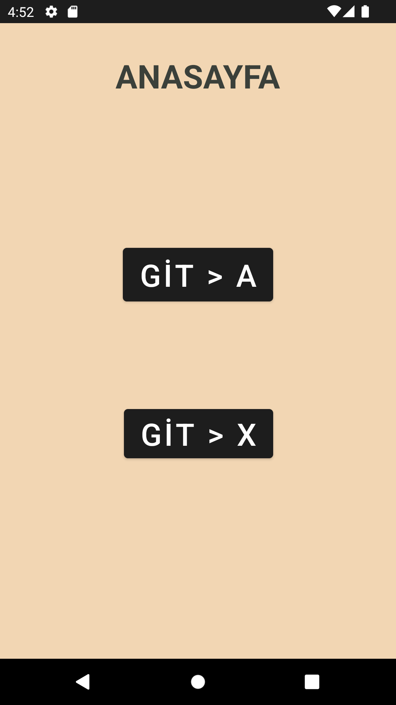

### DefactoUygulamasi
- Defacto mağazasının mobil uygulamasının arayüzü yapıldı.
- Tasarımlara ulaşmak için View Binding kullanılıdı.
- Uygulamada kullanılan fonta yakın bir font araştırıldı ve uygulandı.
- Navigation component ve bottom menu kullanıldı.
- Ürünler ve kategoriler için card view tasarlandı.
- Fab button ile favoriye ekleme bölümü oluşturuldu.
- Ürünün renk seçeneklerini gösteren bir bölüm oluşturuldu. Eğer ürünün renk seçeneği yok ise o bölüm görünmeyecektir. Bu yapı kodlama ile sağlandı.
- Listelemede ürün isimlerinin gösterilen karakter sayısı sınırlandırıldı.
- Listeleme için recycle view kullanıldı.
- - Kategori listelemede swagger grid layout manager-horizontal
- - Ürün listelemede swagger grid layout manager-vertical
- Ürünler ve kategoriler için adapter kullanıldı
- Gösterilen ürün sayısı kullanıcıya görünüm - sırala - filtrele menüsünün üzerinde gösterildi.
- Uygulama iconu aslına uygun olarak düzenlendi.
#### Uygulama Görseli

### NavigationComponent
- Fragment ile Anasayfa, A Sayfası, B Sayfası, X Sayfası, Y Sayfası oluşturuldu.
- Navigation component kullanarak sayfalar arasında geçiş yapıldı.
- Y sayfasının geri tuşuna basıldığında anasayfaya geçiş yapılacak şekilde düzenleme yapıldı.
#### Uygulama Görselleri
+ 
+ 
+ 
+ 
+ 

### HesapMakinesi
- Buttonlar ile tuş takımı oluşturuldu.
- Toplama, silme ve sonuç gösterme fonksiyonları oluşturuldu.
- Kullanıcı sadece tuş takımı ile işlem yapabilir.
- Ondalıklı işlemler yapılabilir.
#### Uygulama Görseli

### FilmApplication
- Bir sitede görülen Netflix görsel tasarımı yapıldı.
- Kayan resimler için horizontal scroll view kullanıldı.
#### Uygulama Görseli
